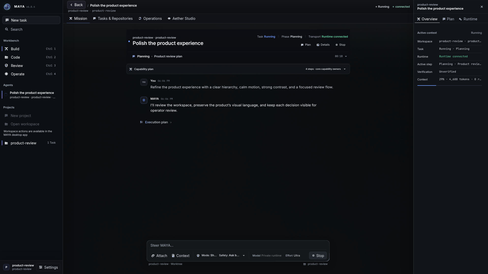
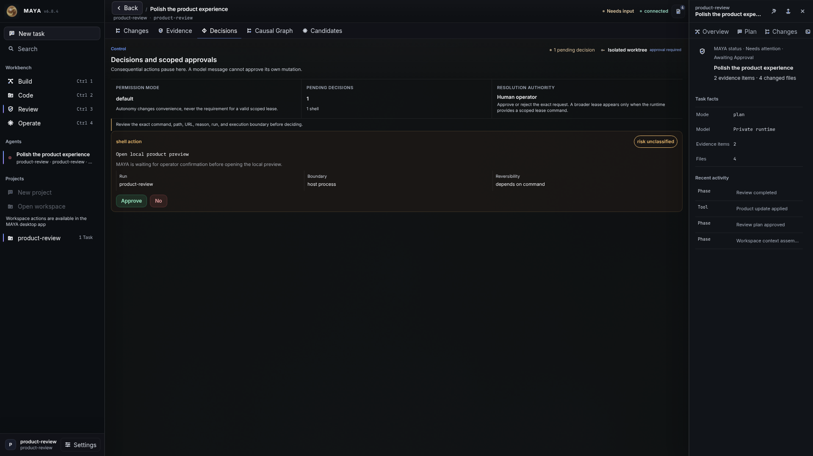

# MAYA — Codex Nexus

**A private, local-first engineering workspace for turning intent into reviewed,
evidence-backed change.**

Built and product-directed by **Sasho Abdulrahim Derama**.

[Product brief](PRODUCT_BRIEF.md) · [Professional profile](CV.md) ·
[PDF CV](Sasho-Abdulrahim-Derama-CV.pdf) · [Source access](SOURCE_ACCESS.md)

## Product idea

AI can help create software quickly, but speed is not the same as control. MAYA is designed around
a simple principle: the operator should always be able to understand what is happening, review what
changed, and decide what becomes authoritative.

The workspace brings planning, implementation, review, evidence, and recovery into one coherent
product experience. It is intentionally local-first and keeps unfinished, blocked, and completed
work visibly distinct.

## Actual MAYA interface

These screenshots come from MAYA's real production interface. They use a sanitized demonstration
workspace created for this public showcase; no source code, provider details, private paths,
credentials, logs, or customer data are shown.

### Mission workspace

The primary task view keeps the objective, active plan, current state, and operator controls in one
focused workspace, as shown in the opening capture above.

### Decisions workspace

Consequential actions pause at a clearly scoped approval boundary, with the requested action and
operator authority visible before a decision is made.

## Core experience

| Step | Operator outcome |
| --- | --- |
| **Frame** | Define the objective, working context, boundaries, and intended result. |
| **Work** | Follow progress without losing the task narrative or current state. |
| **Review** | Inspect changes and supporting evidence before accepting an outcome. |
| **Recover** | Understand blockers, retry deliberately, or return to a known state. |

## Product principles

- **Operator control** — automation supports judgement; it does not replace authority.
- **Reviewable change** — important outcomes remain inspectable before acceptance.
- **Clear state** — ready, active, blocked, and completed work are visually distinct.
- **Local-first privacy** — project context stays close to the operator by default.
- **Honest failure** — unavailable capabilities and incomplete work are shown plainly.
- **Calm operational UX** — dense engineering activity is organized for focus, not spectacle.

## Public showcase boundary

This repository is intentionally a **portfolio presentation**, not the application source.
It does not publish internal architecture, execution components, model or provider configuration,
runtime diagnostics, test ledgers, logs, real workspace data, or private implementation history.

The screenshots use representative content and sanitized task states. They do not contain real
project names, internal paths, credentials, provider details, source code, or operational
telemetry.

## Status

MAYA is an independently directed product in active private development. The public material
describes the product direction and interaction model; it is not a claim that every planned
workflow is universally available or production-certified.

## Creator

**Sasho Abdulrahim Derama** builds AI-enabled products and software platforms with a focus on
operator control, trust, recovery, and clear outcomes.

[Read the professional profile](CV.md) ·
[View GitHub profile](https://github.com/gonzo-max2)
